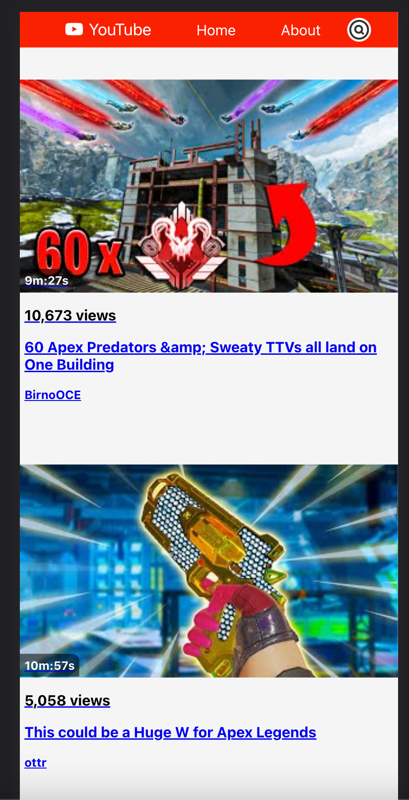
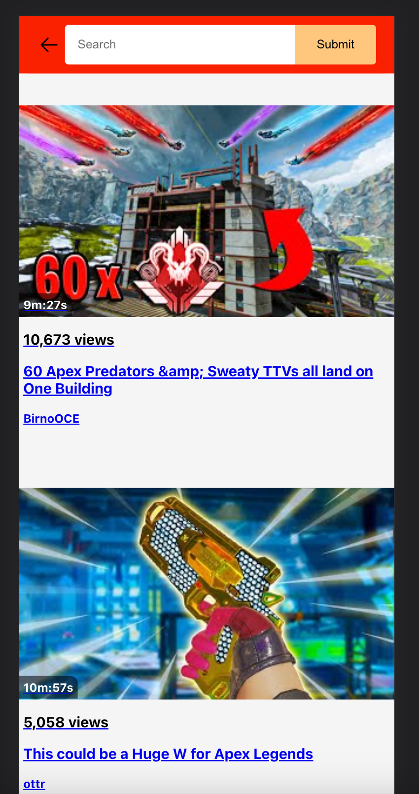

<h1>YouTube Clone Project</h1>
=> See our <a href="https://trello.com/b/SUgPghQi/react-project-board" target="_blank">Trello Board</a>.

<h1>Ɛ> Group Members <3</h1>
<ul>
<li><a href="https://github.com/KleemoffDeveloper">Silis Kleemoff</a></li>
<li><a href="https://github.com/waiLeongChong">Wai Leong Chong</a></li>
<li><a href="https://github.com/wrightKinu">Kinu Wright</a></li>
</ul>

# About

A large part of this project has been collaboration and teamwork with all of the group members. We opened up a Trello board, communicated about
GitHub commits, and distributed the work between us. It has been a huge learning experience and also quite necessary for the field we're working in.
We are super proud of the work we've done and we hope you enjoy our project!

<b><u>Note: </u></b>One of our previous versions were requesting the YouTube API too often and used up our tokens instantly. <a href="https://github.com/waiLeongChong">Wai Leong Chong</a> brought this to our attention and fixed the issue. This means that the <ins>duration</ins> and <ins>view count</ins> will <b>no longer</b> be displayed as shown in the screenshots. Thank you for your understanding.

# Screenshots

<ul>
    
    
    
    
</ul>
